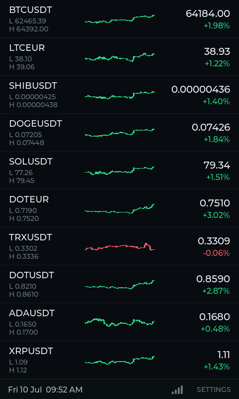
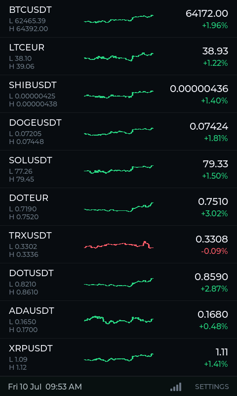
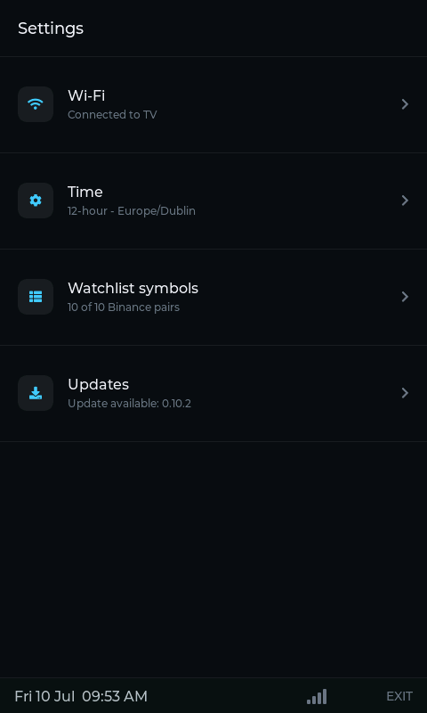

# Hardware validation: dashboard UI with live data (Phase 11)

## Environment

- Date: 2026-07-10
- Board: JC4880P443C_I_W
- Target: esp32p4
- ESP-IDF: v6.0.1
- Port: /dev/cu.usbmodem101
- Wi-Fi: existing saved profile ("TV") in encrypted NVS
- Watchlist: 10/10 symbols (BTCUSDT, LTCEUR, SHIBUSDT, DOGEUSDT, SOLUSDT,
  DOTEUR, TRXUSDT, DOTUSDT, ADAUSDT, XRPUSDT) - same watchlist the device
  was already running with, no reflash needed for this pass
- Locale: 12-hour time, `Europe/Dublin`

## Method

The device was already running normally (Wi-Fi connected, watchlist
bootstrapped, WS ticking) when this validation started, so no
flash/reboot was needed - screenshots were captured directly off the live
screen with the [`dev-screenshot`](../../.claude/skills/dev-screenshot)
skill (`tools/dev_screenshot.py`, local-only
`CONFIG_DEV_SCREENSHOT_CONSOLE=y`, not part of the shipped
`sdkconfig.defaults`). `--nav` was used to switch screens for the
Settings capture instead of a physical tap.

## Scenario 1: watchlist screen renders all 10 rows with real Binance data

**Passed.** All 10 rows render as distinct objects: symbol, 24h low/high,
sparkline, last price (adaptive precision - `64184.00` for BTCUSDT vs
`0.00000436` for SHIBUSDT), and %-change colored green/red per sign
(`TRXUSDT` shown red at `-0.06%`, everything else green). Status bar
shows date/time, Wi-Fi signal-strength icon, and the uppercase `SETTINGS`
nav label from the latest restyle. Both watchlist and status bar fit the
480x800 panel with no scrolling.

## Scenario 2: prices tick live, not just at boot

Second capture taken ~8s after the first, no user interaction in
between:

| Symbol | t0 | t1 |
|---|---|---|
| BTCUSDT | 64184.00 / +1.98% | 64172.00 / +1.96% |
| DOGEUSDT | 0.07426 / +1.84% | 0.07424 / +1.81% |
| SOLUSDT | 79.34 / +1.51% | 79.33 / +1.50% |
| TRXUSDT | 0.3309 / -0.06% | 0.3308 / -0.09% |

Clock in the status bar also advanced (`09:52 AM` -> `09:53 AM`).

**Passed.** Confirms these are live WebSocket-driven ticks landing in
`app_state` and reaching the screen via point-in-place row updates
(Phase 9/11), not a static render from REST bootstrap.

## Scenario 3: Settings screen reflects real device/network state

**Passed.** Navigated via `--nav settings` (no physical tap): Wi-Fi shows
"Connected to TV" (the real saved profile), Time shows "12-hour -
Europe/Dublin" (real locale settings), Watchlist symbols shows "10 of 10
Binance pairs" (the Phase 11 slice 4 limit), Updates shows "Update
available: 0.10.2" (a real pending release from the Phase 10 OTA check).
Status bar's nav label correctly reads uppercase `EXIT` on this screen
instead of `SETTINGS`.

## Result

Passed. All three screens/scenarios show real device state and real,
live Binance market data - not fabricated or REST-bootstrap-only values.
This closes the last open Phase 11 acceptance criterion ("Validated on
real hardware with live data"); no bugs found during this pass.
