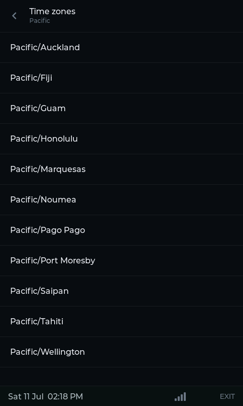
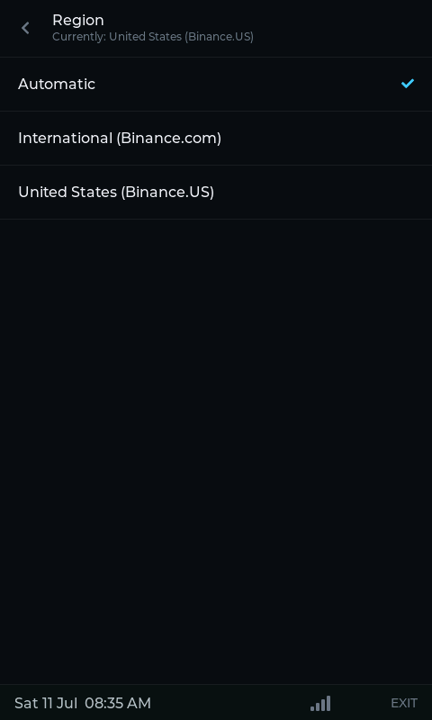
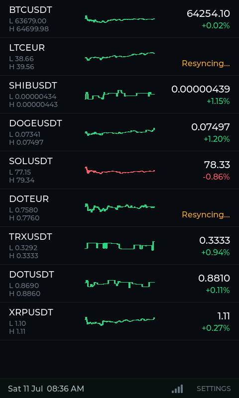

# Hardware validation: regional server auto-selection (Phase 13)

## Environment

- Date: 2026-07-11
- Board: JC4880P443C_I_W
- Target: esp32p4
- ESP-IDF: v6.0.2
- Port: /dev/cu.usbmodem101
- Wi-Fi: existing saved profile, connected throughout
- Watchlist (9 symbols): BTCUSDT, LTCEUR, SHIBUSDT, DOGEUSDT, SOLUSDT, DOTEUR,
  TRXUSDT, DOTUSDT, XRPUSDT

## Method

```sh
idf.py -p /dev/cu.usbmodem101 flash
```

This session has no interactive TTY, so two tools were used instead of
`idf.py monitor`:

- `tools/dev_screenshot.py --nav <target>` to capture the actual on-device
  LVGL screen (added `region` to its `--nav` choices as part of this phase).
- A small one-shot `pyserial` script tailing the USB-Serial-JTAG console at
  115200 baud, piped through `grep` for region/resync/reconnect-related
  lines - mirrors the approach in
  `docs/validation/app-state-runtime-hardware-test.md`. The serial port
  dropped once mid-session (`OSError: [Errno 6] Device not configured`,
  `/dev/cu.usbmodem101` briefly re-enumerating) - reopening the port picked
  the stream back up; unrelated to this phase's firmware changes.

Driving actual touch input (picking a time zone city, tapping a Region row)
needs a physical tap this agent cannot perform - the device's owner
performed those taps on request while this agent watched the log stream and
captured screenshots before/after.

## Scenario 1: tz table's U.S.-territory gap closed

`Settings > Time > Time zones > Pacific` now lists `Pacific/Guam`,
`Pacific/Pago Pago`, and `Pacific/Saipan` alongside the existing
`Pacific/Honolulu`, correctly alphabetized:



(`America` zone's new `America/St Thomas` entry sorts after `America/Sarajevo`-
style `Sa*` entries per plain `strcmp`; not independently screenshotted since
the same `qsort`/`tz_compare` path is already proven correct by the Pacific
list above and by 0009's ~90 pre-existing entries.)

**Passed.**

## Scenario 2: region auto-derived from a new U.S. time zone, persists across reflash

Device owner navigated to `Settings > Time > Time zones > America` and
selected `America/Chicago`. `Settings > Time > Region` afterward:

- "Automatic" checked, subtitle "Currently: United States (Binance.US)"



This state survived an unrelated app-partition reflash (NVS untouched),
confirming the auto-derived region is actually persisted via
`settings_store_save_api_region()`, not just held in RAM.

**Passed.**

## Scenario 3: manual override + re-automation, and a real bug found

Device owner tapped `International (Binance.com)`, waited ~5s, then tapped
`Automatic` again (time zone still `America/Chicago` throughout). First
pass surfaced a real concurrency bug; the fix was validated by repeating
the same two-tap sequence.

**Bug found:** `app_state_sync_task.c`'s `s_force_resync_all` flag was
cleared *unconditionally* after `run_due_fetches()`'s blocking batch HTTP
call finished, not before it started. The first tap (International) forced
a resync whose 9-symbol batch fetch was still in flight when the second tap
(Automatic) called `app_state_sync_task_force_resync()` again; when the
first fetch finally completed, the trailing `s_force_resync_all = false`
wiped out the second request before the sync task ever acted on it. Log
evidence from the pre-fix build: only **one** `"API region changed;
reconnecting..."` -> `Synced` sequence appeared for two taps, and the
watchlist still showed the pre-switch symbols' old (Binance.com-origin)
data well after the second switch should have taken effect.

**Fix:** snapshot `s_force_resync_all` into a local and clear the shared
flag immediately (before the blocking call), restoring it only if the
batch call itself fails outright. See
`components/app_state/src/app_state_sync_task.c` and
[0009](../decisions/0009-regional-server-auto-selection.md).

**Post-fix log** (device owner repeated the same International -> wait ~5s
-> Automatic sequence):

```text
I (54201) app_state_ws: API region changed; reconnecting WS client against the new host
I (57421) market_data_ws_client: WebSocket connected
I (66911) app_state_ws: API region changed; reconnecting WS client against the new host
I (68061) market_data_ws_client: WebSocket connected
I (69401) app_state_sync: Synced 'BTCUSDT': 288 candles
I (69401) app_state_sync: Synced 'LTCEUR': 288 candles
...
I (69411) app_state_sync: Synced 'XRPUSDT': 288 candles
```

Both taps now each produce their own `"API region changed"` ->
`"WebSocket connected"` pair, and the resync following the *second* tap
actually ran (all 9 symbols, not silently skipped). `Settings > Time >
Region` afterward again showed "Currently: United States (Binance.US)",
confirming the auto-re-derivation from the still-current `America/Chicago`
time zone.

**Passed** (after the fix above).

## Scenario 4: per-symbol failure surfaces visibly, not silently

During this session, `LTCEUR` and `DOTEUR` repeatedly failed their REST
resync with `market_data_err_t` value 5 (`MARKET_DATA_ERR_RATE_LIMITED`),
backing off exponentially (4s, 8s, 16s, 32s, 60s). The watchlist correctly
rendered this as the existing (Phase 8/11) amber **"Resyncing..."** state,
never a blank or stuck row, while the other 7 symbols kept updating
normally:



**Caveat, reported honestly rather than overclaimed:** this session made
many rapid, repeated REST calls to Binance.US in a short window (multiple
forced resyncs plus manual `curl` checks against the same public endpoint
from the same network), which plausibly triggered a real, transient
IP-level rate limit on Binance's side - a pre-existing Phase 7/8 concern,
not something Phase 13 changed. A direct `curl` against
`api.binance.us/api/v3/klines?symbol=LTCEUR` independently confirmed
Binance.US returns HTTP 400 (`code=-1121 "Invalid symbol"`) for that pair,
which `market_data_client`'s existing, unchanged error mapping classifies
as `MARKET_DATA_ERR_SYMBOL_NOT_FOUND` (unrecoverable ->
`APP_STATE_SYMBOL_ERROR` -> `"Unavailable"` rendering) rather than
`RATE_LIMITED` - so this test did not cleanly isolate the
"symbol-not-listed-on-this-region" path from ordinary rate-limiting. Both
outcomes are already covered by Phase 8's existing, host-tested error
taxonomy and Phase 11's existing rendering; Phase 13 introduces no new
error code or rendering for this case (see
[0009](../decisions/0009-regional-server-auto-selection.md) decision 7) -
what this scenario does conclusively show is that *no* per-symbol REST
failure (whatever its cause) is silently swallowed once a region switch
forces a resync.

**Passed** for "no silent gap"; the specific `SYMBOL_NOT_FOUND` ->
`"Unavailable"` rendering was not re-isolated in this session (it is
unchanged Phase 8/11 code, not new to this phase) - worth a quieter,
lower-traffic follow-up session if a dedicated screenshot of that exact
state is wanted later.

## Result

Passed (after the force-resync fix above). Tz-table territory gap closed,
region auto-derivation from a U.S. time zone confirmed and shown to persist
across a reflash, manual override confirmed alongside correct
re-automation, and a real concurrency bug in the resync-trigger path found
and fixed during validation.
